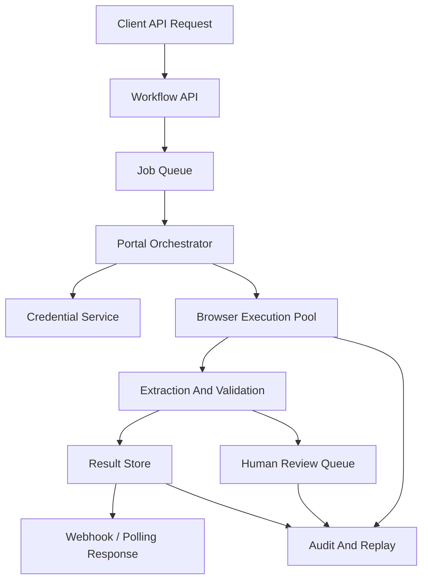

# Payer Portal Automation Dev Plan

## Objective

Build a narrow, production-capable MVP for automating one ugly enterprise workflow:

**claim-status retrieval from payer portals for healthcare revenue-cycle teams**

The goal is not to build a general automation platform first. The goal is to prove that we can reliably:

- log into payer portals
- navigate to claim-status views
- retrieve structured status data
- verify result quality
- handle failures and retries
- route uncertain cases to a human review queue

## Why This Scope

This workflow is a good entry point because it is:

- repetitive
- high-volume
- expensive to do manually
- easier to verify than more complex submission workflows
- useful to RCM teams and BPOs immediately

This scope avoids:

- broad horizontal platform complexity
- write-heavy workflows too early
- high-risk autonomous decisioning
- overbuilding generalized agent infrastructure before proving one use case

## Product Definition

### MVP promise

Given a claim identifier and payer context, the system:

1. opens the correct payer portal session
2. authenticates securely
3. navigates to the claim-status view
4. extracts the current status and relevant fields
5. verifies the output is internally consistent
6. returns structured JSON plus evidence
7. sends failures or low-confidence cases to a human review queue

### MVP is not

- a generic AI agent platform
- full prior-auth automation
- a complete RCM operating system
- autonomous appeals or claims submission
- a replacement for payer APIs where good APIs already exist

## User And Buyer

### End user

- operations analyst
- claims specialist
- offshore/onshore BPO worker
- team lead reviewing exception queues

### Buyer

- healthcare RCM BPO
- claims operations vendor
- revenue-cycle operations leader
- head of automation / operations engineering in RCM

## Core Product Components

### 1. Workflow API

External interface for customers to trigger and receive results.

Requirements:

- submit claim-status retrieval jobs
- support sync and async modes
- webhook/callback support
- idempotency keys
- status polling
- per-customer auth and rate limiting

Suggested endpoints:

- `POST /jobs/claim-status`
- `GET /jobs/:id`
- `POST /jobs/:id/retry`
- `GET /results/:id`

### 2. Session And Credential Layer

Securely manages payer logins and portal sessions.

Requirements:

- encrypted credential storage
- MFA/session-handling support where possible
- session reuse
- secure secrets rotation
- customer/environment separation

### 3. Portal Execution Engine

Runs the actual browser automation.

Requirements:

- browser session lifecycle
- robust element targeting
- step tracing and replay
- retries and recovery
- deterministic fallback paths
- evidence capture (screenshots / page state / extracted fields)

Notes:

- start with browser automation, not full desktop/Citrix support
- add desktop support later only if required by target portals

### 4. Extraction And Validation Layer

Turns messy portal output into structured claim-status results.

Requirements:

- field extraction
- normalization
- confidence scoring
- required-field checks
- duplicate and mismatch detection
- source screenshot linkage

Example result object:

```json
{
  "claimId": "12345",
  "payer": "Example Health",
  "status": "in_review",
  "statusDate": "2026-04-01",
  "amount": 241.13,
  "denialCode": null,
  "notes": "Pending payer review",
  "confidence": 0.93
}
```

### 5. Human Review Queue

This is critical for trust and reliability.

Requirements:

- queue low-confidence results
- queue login/session failures
- queue ambiguous/missing-status cases
- allow human correction and resubmission
- store review reason and final disposition

### 6. Audit And Observability

Enterprise workflows require strong visibility.

Requirements:

- step-by-step execution logs
- screenshots / evidence snapshots
- extracted fields
- run-level error codes
- latency metrics
- portal-specific success/failure rates

## Suggested Architecture



## Recommended Technical Stack

### Backend

- TypeScript or Python backend
- PostgreSQL for jobs, results, audits, review queue
- Redis or managed queue for job orchestration

### Browser automation

- Playwright first
- browser pool abstraction for concurrency
- provider-backed browser infrastructure only if needed later

### AI usage

Use AI selectively for:

- resilient element understanding
- extraction normalization
- failure classification
- verification assistance

Do not rely on AI for every click from day one.

Prefer:

- deterministic workflows where possible
- AI only where structure breaks down

### Storage

- object store for screenshots and artifacts
- encrypted secrets store for credentials

## Development Phases

### Phase 1: Narrow Prototype

Goal:

- prove one payer workflow works end to end

Deliverables:

- single payer
- single claim-status flow
- manual credential provisioning
- one browser runner
- raw JSON result
- screenshots and logs

Success metric:

- reliable claim-status retrieval on repeated runs for one payer

### Phase 2: MVP

Goal:

- support real customer pilot

Deliverables:

- job API
- async job handling
- retry flows
- human review queue
- basic dashboard
- audit trail
- confidence scoring
- 2-3 target payers

Success metric:

- customer pilot with measurable reduction in manual lookup effort

### Phase 3: Pilot Hardening

Goal:

- move from “demo works” to “ops team can rely on it”

Deliverables:

- portal change detection
- better session handling
- stronger validation rules
- SLA/error reporting
- portal-specific runbooks
- operator tooling for replay and correction

Success metric:

- sustained production usage in one live pilot team

### Phase 4: Expansion

Goal:

- add adjacent workflows and more payers

Candidates:

- document upload
- eligibility lookup
- remittance status
- payment posting support
- prior-auth status retrieval

## 90-Day Engineering Plan

### Days 1-30

- finalize target workflow and payer shortlist
- build job model and execution runner
- implement one portal end-to-end
- build extraction output schema
- store screenshots and run traces
- measure baseline success rate

### Days 31-60

- add queueing and async execution
- add confidence scoring
- add human review UI
- add retry and recovery logic
- support second payer
- add customer-facing API contract

### Days 61-90

- harden auth/session handling
- improve portal robustness
- build operational dashboard
- define pilot SLAs
- onboard first design partner
- ship reporting for time saved / jobs processed / review rate

## Data Model

Minimum entities:

- customers
- users
- credentials
- portal_profiles
- jobs
- job_steps
- extracted_results
- review_items
- review_decisions
- artifacts
- webhooks
- audit_events

## Security And Compliance Requirements

Because this is healthcare-adjacent, assume a high bar early.

Requirements:

- encryption at rest and in transit
- role-based access control
- audit logging
- least-privilege credential handling
- secure artifact storage
- retention policy
- customer isolation

Likely needed soon:

- HIPAA-aware posture
- BAAs depending on customer and data handling
- secure review tooling and replay access controls

## Reliability Requirements

This category wins or loses on trust.

Must-have reliability features:

- retries with reason codes
- portal change alerts
- deterministic fallbacks
- evidence-backed results
- manual review path
- replay tooling
- per-payer runbooks

Target early metrics:

- successful job completion rate
- low-confidence rate
- manual-review rate
- mean time to recover from portal changes
- average lookup time vs manual baseline

## Biggest Risks

### 1. Over-generalizing too early

Avoid building a horizontal automation platform before one workflow is proven.

### 2. Excessive model dependence

Do not make every action LLM-driven if deterministic navigation works better.

### 3. Security shortcuts

Healthcare workflows will punish weak credential or audit design.

### 4. Portal variance

Different payers will behave differently. The system must support payer-specific profiles without becoming fully custom each time.

### 5. Missing human fallback

If human review is not built in early, trust will break.

## Team Needed

Minimum strong founding/early team:

- one backend/platform engineer
- one browser automation / systems engineer
- one product-minded founder or operator close to healthcare ops workflows

Helpful early additions:

- security/compliance advisor
- design partner ops lead
- implementation engineer

## Go / No-Go Checkpoints

Proceed only if:

- at least one design partner confirms claim-status retrieval is painful and high-volume
- one payer workflow can be made reliable enough for repeated production-like runs
- manual-review rate is low enough to show real labor savings

Pause or narrow further if:

- portal complexity makes one workflow unreliable
- customers actually want a service, not a product
- payer workflow variance is too high for the chosen wedge

## Final Recommendation

Build the MVP as:

**claim-status retrieval infrastructure for healthcare revenue-cycle teams**

Do not build:

- broad enterprise agent infrastructure
- multi-workflow platform first
- general healthcare automation suite first

Prove one workflow, then expand outward.
